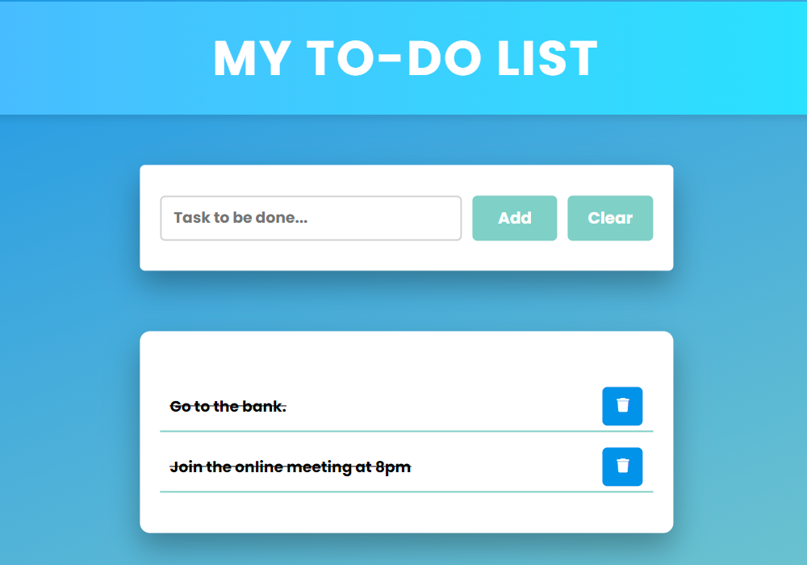

# To-Do List App

This is a simple To-Do List application built using **HTML**, **CSS**, and **JavaScript**. The app allows users to add, delete, and mark tasks as completed. It also includes a "Clear" button to remove all tasks at once.

## Features

- **Add Task:** Enter a task in the input field and click the "Add" button to include it in the list.
- **Delete Task:** Each task comes with a delete icon to remove it from the list.
- **Mark as Completed:** Clicking on a task strikes it through, indicating that it is completed.
- **Clear All Tasks:** The "Clear" button allows you to remove all tasks from the list with a single click.

## Demo

Here's a quick preview of the app:




## Technologies Used

- **HTML** for structuring the layout.
- **CSS** for styling and responsiveness.
- **JavaScript** for dynamic functionality (task addition, deletion, and completion marking).

## Setup

1. Clone the repository:
   ```bash
   git clone https://github.com/yourusername/todo-list-app.git
